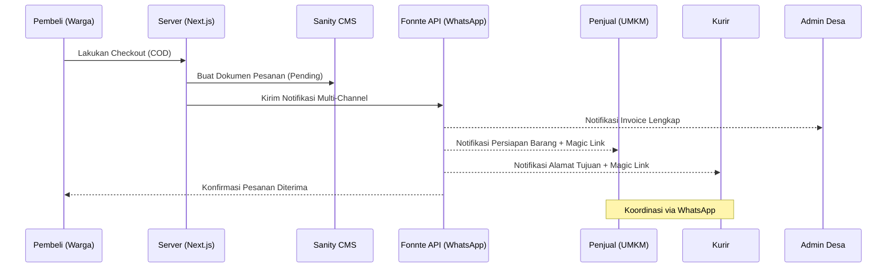
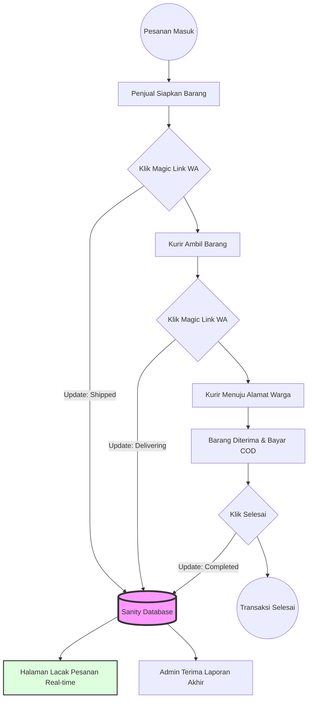
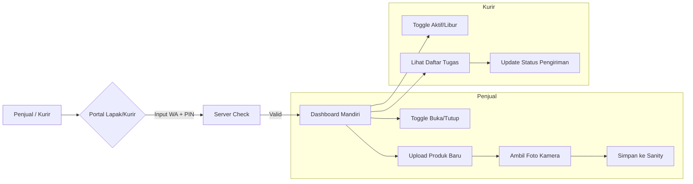

# 📊 Diagram Alur Sistem PAWON

Berikut adalah skrip **Mermaid.js** yang menggambarkan alur kerja aplikasi PAWON dari pemesanan hingga pengantaran. Anda dapat melihat visualisasinya di [Mermaid Live Editor](https://mermaid.live/).

## 1. Alur Pemesanan & Notifikasi (Order Flow)

## 2. Alur Update Status Real-Time (Status Sync)

## 3. Alur Portal Mandiri (Self-Service)

---
*Diagram ini dapat dimasukkan ke dalam file README.md atau dokumentasi teknis lainnya.*
